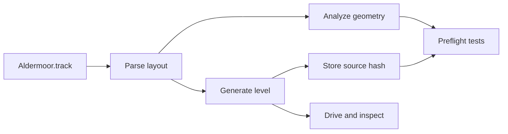
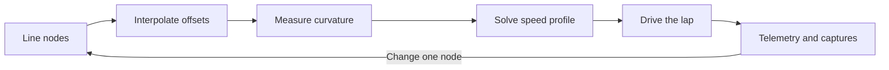
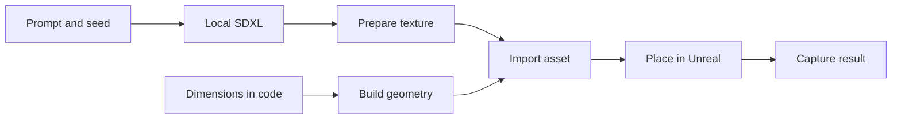

<div class="tldr-box">

**TL;DR** - Overcut can now put a car on a generated circuit, follow an authored racing line, make synthesized engine noise, and complete repeatable multi-lap runs. The useful part is not the laps by themselves. The useful part is the feedback loop around them: the circuit and racing line are reviewable text, agents can rebuild and drive them, and screenshots, telemetry, and tests show what their changes actually did.

</div>

<figure>
  
  <figcaption>
    The first Overcut prototype on Aldermoor. The orange car is Epic's placeholder vehicle, and the circuit is still a graybox.
  </figcaption>
</figure>

## This week, a car learned to finish laps

The first [Building Overcut](/series/overcut) vlog ends with a car driving around a track. That demo is configured for one lap. The car completes it, then wanders off instead of parking. Ask the same automated driver for more laps and it can complete repeatable multi-lap runs.

It follows something resembling a racing line and makes some suspiciously high-pitched engine noises while doing it.

So, progress.

I already wrote about [why I want Overcut to exist](/articles/my-newest-project-is-a-racing-game-overcut). The short version is a collisionless, team-focused racing game where strategy, tire management, driver abilities, and the shared result matter as much as one person's lap time.

This update is about the less polished question: **how do I build and evaluate that game when I am a programmer learning Unreal Engine as I go?**

My instinct is not to open a level editor and start dragging corners around. I want a format I can diff, scripts I can run, tests that reject broken geometry, and a way for an agent to change something and then observe the result.

That instinct produced the most useful parts of the prototype so far.

## The circuit is a text file

Aldermoor is Overcut's first test circuit. The visible level in [Unreal Engine 5.8](https://dev.epicgames.com/documentation/en-us/unreal-engine/unreal-engine-5-8-documentation) is generated from `Tracks/Aldermoor.track`.

The file reads from the start line through each named piece of the lap:

```text
circuit      Aldermoor
road         12 m
kerb          1.5 m
runoff       15 m
target-lap   70 s

straight   448.736 m                  road 15 m   bank right 1  Bridgeway Straight
right       60 m   119.727 deg        road 12 m   bank 3        T1 Bridge
straight   268.398 m                  road 10 m   runoff 6 m    flat  Hairpin Approach
left        18 m   125.234 deg                                    T2 Alder Hairpin
```

That is not a list of meshes. It is the intent of the circuit.

Each straight or corner has a length. Corners have a radius and sweep. Optional modifiers describe the road width, runoff, gradient, and banking. Those values are sticky and transition across a piece instead of changing instantly, because a sudden width or banking change would be a bump the suspension finds.

The names matter too. `T2 Alder Hairpin` is useful in a pull request, a test failure, a telemetry report, and a command that puts the car at that corner. `piece[3]` is not.



The parser turns the file into a circuit layout. A commandlet builds the Unreal level. The generated level stores a hash of the parsed layout, and a preflight test fails if somebody changes the source without rebuilding the level.

The hash is based on the meaning of the file, not its bytes. Rewording a comment does not make the level stale. Changing the road from 15 meters to 16 does.

Once the track became data, design requirements became automation tests:

- Does the loop close in position, heading, height, width, and banking?
- Does the circuit cross itself?
- Does it include a useful mix of hairpins, medium corners, sweepers, and straights?
- Can a width or radius combination fold the road surface inside out?
- Does the generated level still match the text that supposedly created it?

Those are stronger questions than "does this look about right in the viewport?"

<figure>
  
  <figcaption>
    Aldermoor's hairpin from overhead. The layout, road width, runoff, and corner radius all come from the track file.
  </figcaption>
</figure>

Text did not magically make track design easy. Closing a loop built from relative straights and corners is annoyingly hard. Early attempts produced negative straight lengths, a self-intersecting circuit, and one 24 percent gradient that was less "parkland circuit" and more "ski jump."

The current layout came from a star-shaped polygon whose construction prevents self-intersection and guarantees one complete revolution. The important lesson was not the polygon. It was recognizing that repeated validation failures were a sign to choose a representation where those bad states were harder to create.

## A racing line records intent, not a replay

The first automated driver followed the center of the road. That was enough to prove the car could move, but not enough to evaluate it.

A centerline lap barely loads the car. It does not use the full track width, open a corner's radius, or ask much from the suspension and tires. That makes it a bad measuring instrument for handling, camera motion, audio, and eventually the HUD.

Overcut now keeps authored `.line` files beside the circuit:

```text
line         fast
circuit      Aldermoor
grip         1.7
brake-g      1.5
throttle-g   0.9

at  T1 Bridge -10 m          left  5.5 m
at  T1 Bridge +75 m          right 4.5 m
at  T2 Alder Hairpin +22 m   left  3.5 m   74 kph
```

Each node says where the car should sit across the road at a named place. Most nodes do not specify speed. The solver measures the path's curvature and computes what the car can carry. A speed cap is only needed where geometry is too optimistic, such as an off-camber corner or a chicane.

The file also has no braking points. A braking point is the result of the apex speed and `brake-g`, so storing one would write the same fact twice. The solver works backward from the corner speed and finds the braking point on its own.



The `fast` and `conservative` files are not simply the same path at two speeds:

| Dial | Fast line | Conservative line |
| --- | ---: | ---: |
| Grip budget | 1.70 | 1.55 |
| Braking | 1.50 g | 1.10 g |
| Throttle | 0.90 g | 0.65 g |
| T2 hairpin cap | 74 kph | 62 kph |
| Typical behavior | Full road, later apexes | More margin, earlier apexes |

That gives the project two repeatable driving conditions. The fast line can load the suspension and tires. The conservative line can exercise audio, camera, and UI behavior without pretending every lap is qualifying.

Why author those lines instead of recording one good lap?

A recorded lap is the outcome of one car, one physics setup, and one engine timestep. Change the handling and the recording becomes wrong. An authored line says, "Be here, with roughly this much speed." That intent can survive the car changing underneath it.

The distinction matters for agentic work too. An agent can read why T2 is capped at 74 kph, change one node, run the tests, watch the car, and compare telemetry. A recorded lap would only tell it that the old car once did something different.

## The agent needs to see the car miss the corner

The text formats are only useful because they connect to the running game.

The command I used in the video is deliberately boring:

```powershell
scripts/Watch.ps1 -Line fast -Laps 1
```

It launches the game, selects the line, and asks the bot to drive a lap. Other scripts can run automation tests, record telemetry, estimate a lap, or capture named camera positions.

Changing that command to `-Laps 3` runs the repeatable multi-lap case instead.

This is the same idea as the ["touch-grass" scripts I built for Aloud Cards](/articles/what-building-aloud-cards-taught-me-about-agentic-engineering). An agent conversation can make almost any code change sound reasonable. A running product is less polite.

That loop currently combines three kinds of evidence:

| Evidence | What it answers |
| --- | --- |
| Automation tests | Is the file valid, the circuit closed, and the speed profile achievable? |
| Telemetry and analysis | Did the path, lap estimate, or vehicle behavior change numerically? |
| Screenshots and a watched lap | Does the car actually hold the line, and does the result look believable? |

One of the first racing-line drafts looked generous and smooth in the text file. It was also slower than driving down the middle because the car reached the inside too early and made the hairpin tighter. A temporary CSV dump made the mistake obvious.

That is exactly the kind of failure I want this project to expose cheaply.

## Three art pipelines, one working barrier

I am a programmer, not an artist. Early concept art helped Overcut feel like a project instead of a folder full of C++, but images for a website and assets for a game have different jobs.

Right now I have three image-generation paths:

| Model | How I am using it now |
| --- | --- |
| Local [SDXL base 1.0](https://huggingface.co/stabilityai/stable-diffusion-xl-base-1.0) | Seeded textures that can become build inputs |
| Local [FLUX.1-schnell](https://huggingface.co/black-forest-labs/FLUX.1-schnell) | Iteration on cars, circuits, silhouettes, and visual ideas without a per-image API charge |
| Hosted Azure [`gpt-image-2`](https://learn.microsoft.com/en-us/azure/foundry/openai/how-to/dall-e) | Published concept and identity art when I need hosted generation or larger output options |

Those jobs are not permanent. I am still learning where each model earns its place. The useful part of having local options is that I can generate and reject a lot of ideas without paying for every attempt. Hosted generation is still available when its quality or output options are worth the cost.

The blue barriers in the screenshots are the first concrete success from that setup. They now run outside the T2 hairpin and along both sides of the Fold, where the circuit narrows around the chicane.

Their surface started as a locally generated SDXL image. Most candidates were rejected. The accepted texture was de-lit to remove shadows and highlights the image model had painted into the plastic, then checked before it went anywhere near Unreal.

The barrier's shape comes from code. A Python script builds a 328-triangle module with exact dimensions and matching ends. The generated image supplies the worn blue-plastic surface; the script supplies the geometry that lets hundreds of modules connect cleanly around a corner.



Before import, another script previews several copies connected together and checks the geometry and texture. The importer then creates the Unreal assets and places the modules beside the circuit. The trackside capture below makes the barrier easy to see; the final review also includes the cockpit view a player will actually use.

<figure>
  
  <figcaption>
    Generated surfaces on code-built blue barriers at the Fold. The current line and controller are repeatable, not perfect.
  </figcaption>
</figure>

That is the pipeline I want more of: use a local model where it helps, keep the exact constraints in code, and make the result cheap to inspect. I do not know yet whether the same split will work for cars, drivers, buildings, or every other asset Overcut eventually needs. This barrier proves it can work for at least one real thing in the game.

## Unreal MCP helps, but it does not replace the loop

[Unreal Engine 5.8](https://dev.epicgames.com/documentation/en-us/unreal-engine/unreal-engine-5-8-documentation) includes the experimental first-party [Unreal MCP plugin](https://dev.epicgames.com/documentation/en-us/unreal-engine/unreal-mcp-in-unreal-editor). Overcut runs that MCP server inside the editor so an agent can inspect actors and scene content, create material instances, and run automation tests instead of guessing about binary `.uasset` files.

That capability is useful, especially because so much Unreal work normally happens in a GUI. It does not change the project's authority model:

- C++ and text files still live in Git.
- Binary assets still need to be edited through Unreal and described in prose.
- Agent changes still have to pass the same preflight gate.
- The MCP endpoint stays on local loopback and only exists while the editor is running.

The plugin lets an agent reach the editor. The track files, scripts, tests, telemetry, and screenshots give that access a disciplined job to do.

## Is it a racing game yet?

Not really.

<figure>
  
  <figcaption>
    The current cockpit view on Bridgeway Straight. Camera placement, placeholder geometry, and visual detail all still need work.
  </figcaption>
</figure>

It is an [Epic Games](https://www.epicgames.com/) placeholder car on a blockout circuit. The engine, tire, and shift sounds are synthesized stand-ins. The cockpit camera clips through parts of a vehicle that was not built for this view. The automated driver can still miss the line or wander off after its requested laps are done.

It is also more than the empty project from a week earlier.

I can describe a corner in text, build it into an Unreal level, put the car at that named corner, ask it to drive a specific line, collect telemetry, take the same screenshots every week, and see whether a change made the result better or worse.

That is enough of a product loop to keep going.

## Tools and resources

| Resource | Why it matters |
| --- | --- |
| [Overcut](https://overcut.racing/) | The current game concept and visual direction |
| [Unreal Engine 5.8 documentation](https://dev.epicgames.com/documentation/en-us/unreal-engine/unreal-engine-5-8-documentation) | Engine documentation for the prototype |
| [Unreal MCP](https://dev.epicgames.com/documentation/en-us/unreal-engine/unreal-mcp-in-unreal-editor) | Epic's experimental MCP server for connecting agents to the editor |
| [GitHub Copilot documentation](https://docs.github.com/en/copilot) | The agents and coding tools used across the project |
| [Model Context Protocol](https://modelcontextprotocol.io/) | The protocol connecting an agent to the Unreal editor |
| [SDXL base 1.0](https://huggingface.co/stabilityai/stable-diffusion-xl-base-1.0) | Local image generation for seeded surfaces |
| [FLUX.1-schnell](https://huggingface.co/black-forest-labs/FLUX.1-schnell) | Local image generation for exploration and concept work |
| [Azure OpenAI image generation](https://learn.microsoft.com/en-us/azure/foundry/openai/how-to/dall-e) | Official `gpt-image-2` guidance for hosted concept generation |

## Closing thought

The laps are rough, but I can watch them and tell you why the car did what it did. I can trace the circuit back to a text file, the racing line back to a few authored nodes, and the barriers back to a prompt, a geometry script, and a set of checks.

That is not a finished game.

It is finally a system I can learn from.
