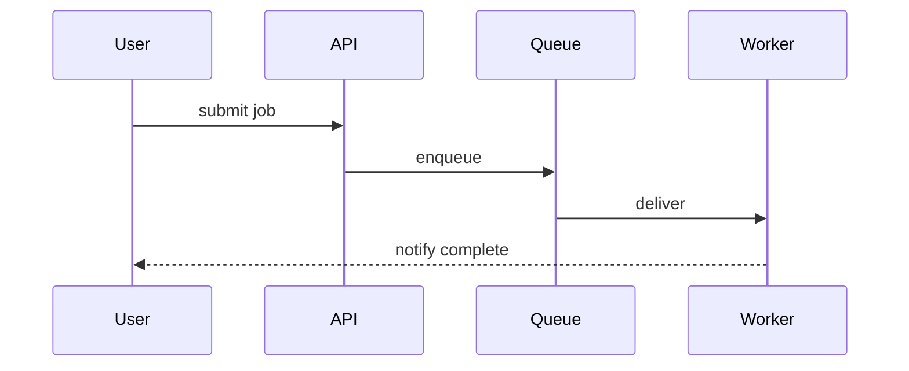

<div class="tldr-box">

**TL;DR** — We stopped throwing pull requests at the whole team and hoping someone bites. Now every review gets **intentionally assigned to two people** — someone who knows the area, plus a junior engineer we're bringing along. And we're leaning more on two things in our PRs: **proof the change was validated**, and a **diagram or two** explaining how it fits the bigger picture. The result is less line-by-line nitpicking and more reviewing for the stuff that actually bites you — integration, sequencing, and merge conflicts.

</div>

## The old way was kind of a mess

For a long time, our code review process was basically: open a PR, ping the team channel, and wait for whoever felt like grabbing it. Sometimes that was fast. More often it sat there. And there was a natural tendency at play — never a rule, just how things drifted — where the senior engineers tended to pick up most of the reviews.

That made sense in the moment, but it had a couple of side effects.

The senior folks ended up carrying a lot of it, on top of their own work. And without meaning to, it left some of our junior engineers feeling like reviews weren't really theirs to do — like they either didn't need to weigh in or couldn't. Which is a shame, because reviewing other people's changes is one of the best ways to learn a codebase, and they were quietly missing out on it.

> This wasn't a top-down mandate or some insight I had. It came out of a team discussion where we looked at how reviews were going and decided the free-for-all approach wasn't going to scale — and that we wanted a deliberate way to get junior engineers involved in reviews earlier.

## So we started treating reviews like work items

The shift was small but it changed everything: **we assign reviews on purpose.**

Instead of broadcasting to the whole team, every PR gets two named reviewers:

- **Someone who knows the area.** Note that I didn't say "a senior engineer." It's whoever actually understands that corner of the product — sometimes that's a senior, sometimes it's the person who's been living in that module for a month. The point is *context*, not seniority.
- **A more junior engineer.** On purpose. This is how we get them engaged early — reading real changes, asking questions, learning the product and the rhythm of reviewing before anyone expects them to be the expert.

Once a review has a name on it, it stops being everybody's problem (which is nobody's problem) and becomes an actual tracked piece of work — same as a ticket. It gets picked up. It gets finished.

If your team runs on GitHub, you can lean on the platform for this instead of doing it by hand. [Code review assignment for teams](https://docs.github.com/en/organizations/organizing-members-into-teams/managing-code-review-settings-for-your-team) can auto-distribute requests, and [`CODEOWNERS`](https://docs.github.com/en/repositories/managing-your-repositorys-settings-and-features/customizing-your-repository/about-code-owners) makes the "someone who knows the area" part automatic. The mechanism matters less than the intent: **two people, on purpose, every time.**

## Bringing junior engineers in early

I want to dwell on this part because it's the bit I'm most excited about.

Reviewing other people's code is one of the fastest ways to learn a codebase — arguably faster than writing your own features, because you get exposed to corners you'd never touch otherwise. When fewer people are in the reviews, that learning opportunity just doesn't reach as many of them.

But here's the part I didn't fully appreciate until we started doing it: **junior engineers — and anyone new to the product — tend to ask really good questions.** Often they're the questions everyone secretly has but that have gone unspoken for so long they feel settled. "Why is it done this way?" "What actually depends on this?" That fresh perspective has a way of surfacing things the rest of us had stopped noticing — sometimes a genuine gap in the design, sometimes just a gap in our shared understanding of how the product works. Either way, it's worth a lot.

Now they're paired with someone more experienced on real PRs. They see how the experienced reviewer thinks, what questions they ask, what they choose *not* to sweat. Nobody's expecting a junior to catch a subtle concurrency bug on day one. That's not the point. The point is reps — and a low-stakes way to ask "wait, why is it done this way?" without it being a whole thing.

It also quietly takes load off the senior engineers, because review is no longer a single point of failure routed through four people.

## The two artifacts we're leaning on more

Here's the part that's changed *what* we review, not just *who* reviews.

These days our AI agents write a lot of the code, and honestly it's pretty reliable. There are still edge cases and gnarly bits a human has to think through — that hasn't gone away — but for a big chunk of changes, staring at every line isn't where the value is anymore. So we've started asking for two things in our PRs — not as a hard gate on every single one, but as the stuff we're finding genuinely valuable and trying to make a habit:

### 1. Evidence the change was actually validated

What did you test? What did you run? If you poked at it manually, tell me what you poked at and what you saw. If there are automated tests, point at them. I want the engineer's verification *thought process* in the PR, not implied.

A lightweight section in your [pull request template](https://docs.github.com/en/communities/using-templates-to-encourage-useful-issues-and-pull-requests/creating-a-pull-request-template-for-your-repository) is enough to make this a habit:

```markdown
## Validation

- [ ] Unit tests added/updated and passing
- [ ] Manual check: <what you did, what you expected, what you saw>
- [ ] Edge cases considered: <list them>

## How this fits

<one or two diagrams + a sentence on where this sits in the system>
```

### 2. A diagram (or two) explaining the change at a high level

Not architecture-astronaut stuff — just enough to show how the change fits the larger system. Where does this sit? What does it talk to? What did the flow look like before versus after?

You don't need fancy tooling. [Mermaid](https://mermaid.js.org/) renders right inside a GitHub PR from a fenced code block, so a sequence or flow diagram is just text you commit:



When a change is bigger or fuzzier, a quick whiteboard-style sketch in something like [Excalidraw](https://excalidraw.com/) does the job too. I actually built a little [Excalidraw Workbench canvas](https://github.com/cirvine-MSFT/copilot-toolkit/tree/main/extensions/excalidraw-workbench) for the GitHub Copilot app so I can sketch and tweak these diagrams right next to the agent without leaving the tool — it's part of my [copilot-toolkit](https://github.com/cirvine-MSFT/copilot-toolkit) if you want to poke at it. The medium isn't the point — the shared mental model is.

## We're reviewing at a higher level now

Put those two artifacts together and the review itself changes character. We still read the code — of course we do — but we're spending more energy on questions like:

- Does this change actually make sense for what we're trying to do?
- Is it sequenced right relative to everything else in flight?
- How's it going to integrate with the other PRs landing this week?

That last one is the big one. When you crank up the *volume* of changes — and AI-assisted development absolutely cranks up the volume — the risk moves. It stops being "is this one function correct" and becomes "do these ten changes fit together." A lot of bugs don't live in any single PR. They hide in the merge conflicts, the overlapping edits, the integration seams between changes that were each fine on their own.

So we review more like integrators than line-editors. The diagram tells me how your piece slots in. The validation tells me you've already kicked the tires. That frees the human review to focus on the stuff humans are still uniquely good at: judgment, sequencing, and spotting where two reasonable changes are about to collide.

## Where AI fits in the review itself

Worth being clear about this, because it's easy to get wrong: yes, we use AI in our reviews — but as an assistant to a human, not a replacement for one. Microsoft has some automated systems that drop comments on pull requests on their own, and that's its own thing. What I'm talking about here is how *we*, as the human reviewers, reach for an agent while we're doing the review.

The most important rule we hold to: **anything an agent writes is clearly marked as written by an AI agent.** If a comment came from an agent, it says so. No passing AI feedback off as a human read.

Beyond that, I mostly use AI as a **rubber duck** for the PR. I'll talk through the change with it — what does this actually do, what areas are worth a closer look, what am I not thinking about? It's a way to make sure I understand the full picture and the bigger pieces before I weigh in, rather than "do a line-by-line pass and call it done just to prove I looked." Sometimes it helps me author a clearer comment or spot an area worth questioning. But the shape of it is always the same: **AI assisting the human in a high-level review** — helping me understand, not handing down the verdict.

> If you want the agent to actually help you understand a change instead of just rephrasing the diff, give it the same context a human reviewer gets — the validation notes and the diagram. Garbage in, garbage rubber-ducking.

## A quick reference

| Practice | What it replaces | How to do it |
| --- | --- | --- |
| Two named reviewers per PR, on purpose | "Whoever grabs it" in the team channel | [GitHub review assignment](https://docs.github.com/en/organizations/organizing-members-into-teams/managing-code-review-settings-for-your-team) + [`CODEOWNERS`](https://docs.github.com/en/repositories/managing-your-repositorys-settings-and-features/customizing-your-repository/about-code-owners) |
| Area-knowledgeable + junior reviewer | Reviews drifting to the same few people | Assign on purpose; rotate juniors in |
| Validation section in the PR | "Trust me, it works" | [PR templates](https://docs.github.com/en/communities/using-templates-to-encourage-useful-issues-and-pull-requests/creating-a-pull-request-template-for-your-repository) |
| High-level diagram in the PR | Reverse-engineering intent from the diff | [Mermaid](https://mermaid.js.org/) in-PR, or my [Excalidraw Workbench](https://github.com/cirvine-MSFT/copilot-toolkit/tree/main/extensions/excalidraw-workbench) canvas |

## Try one thing

If this all sounds like a lot, don't roll it out at once. Pick **one** of these for your next PR:

- Assign a junior engineer as a second reviewer — even if they're just along for the ride.
- Add a three-line "what I tested" section to your PR description.
- Drop one diagram in showing how your change fits.

Any one of those is a real improvement over the free-for-all. Stack them up over a few weeks and the whole thing starts to feel less like a chore and more like... actual work that matters.

## Closing thought

The natural tendency used to be that senior engineers quietly absorbed most of the reviews. We replaced it with something we say out loud: **reviews are work, so we treat them like work** — assigned, paired, and built around explaining the change instead of just inspecting it. Funny enough, taking it more seriously made it lighter for everyone — and made room for our junior engineers to jump in.

If you've made a similar shift on your team — or if you think I've got this wrong — I'd genuinely love to hear about it.
