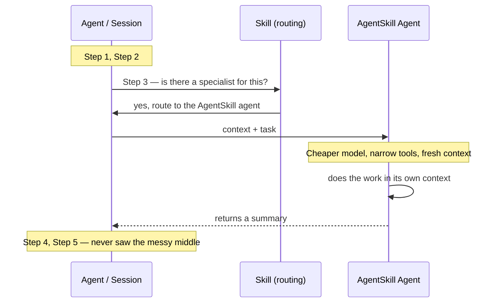

<div class="tldr-box">

**TL;DR** — Take a task you'd normally write as a skill, implement it as a *separate agent* with a cheaper model and a narrow tool set, and let your main session delegate to it as a sub-agent. I've been calling this the **AgentSkill pattern** because I couldn't find an official name for it. The honest scorecard: you almost always get **isolated context**. You *sometimes* get cheaper runs and faster execution. And there's a fourth thing nobody puts on the whiteboard — **quality can quietly get worse**, and your token dashboard won't tell you. This post has the actual frontmatter for both Copilot and Claude Code, plus the gotchas that bit my team.

</div>

## A pattern with no name

My team and I keep reaching for the same shape of solution, and at some point I realized I had no idea what to call it. So I've been calling it the **AgentSkill pattern**, which is not a great name, but it's the one I've got. If you know what this is actually called, please tell me — that's a genuine ask, not a rhetorical one.

In the video I gave the two-minute version. This post is the part I promised on camera: the frontmatter, the details, and the stuff I've learned the hard way.

Quick refresher, because the vocabulary here matters. In my [earlier post on agents, skills, plugins, and extensions](/articles/agents-skills-plugins-extensions), I used an object-oriented analogy that I still think mostly holds up:

- **Agents** are like classes. A persona plus capabilities — who you are, what model you run on, what tools you're allowed to touch.
- **Skills** are like functions. A defined task or procedure. How something should get done.

It's not a perfect mapping — skills are portable across agents, which classes and functions don't really do — but it's close enough for scope and intent.

The AgentSkill pattern is what happens when you take something that looks like a function and implement it as a class anyway. On purpose.

## The shape of it

Here's the whiteboard from the video, cleaned up:



Your main session is chugging through a multi-step task. At step three, the harness notices there's an AgentSkill available for this. It hands off — some context plus the task — to a sub-agent that runs on a cheaper model with a deliberately small set of tools. That sub-agent does the work in its *own* context, writes up a summary, and hands the summary back. Your parent session picks up at step four having never loaded any of the intermediate mess.

That last part is the whole point.

## Why it has to be an agent

Here's the thing that makes this a pattern rather than just "write a skill."

In most harnesses, **agent frontmatter is the only place you can pin the model and fence the tool set.** A skill tells the agent *how* to do something. An agent file tells the harness *what it's allowed to be* while doing it. If you want a cheaper model and fewer tools, you need the agent file.

And I want to reframe the `tools` field, because most guidance talks about it as a *safety* control — "don't let the docs agent run `rm -rf`." That's true and good. But in this pattern you're using it as a **context budget** control.

Every tool available to a session costs context before the agent does anything. The names, the descriptions, the parameter schemas — all of it gets serialized into the model's context window. If you've got a handful of MCP servers connected, that adds up fast. A sub-agent that only needs to read files and run one MCP tool doesn't need to be told about the other forty. Fencing the tools is how you keep the isolated context actually *small*, not just *separate*.

## Copilot: the two-file form

In the Copilot ecosystem this is two files: the agent that does the work, and a thin skill that helps the harness find it.

Take the example from the video — my team has a pipeline RCA agent. When a build fails, it goes and pulls logs, digs through run history, pokes at Azure resources, and comes back with a root cause. The parent session, which is usually trying to *fix* the pipeline, doesn't need any of that raw material. It needs the conclusion.

### The agent

```yaml
---
name: pipeline-rca
description: >
  Investigates failed CI/CD pipeline runs and returns a root cause analysis.
  Use when a build or release pipeline has failed and someone needs to know why
  before attempting a fix.
model: claude-haiku-4.5
tools:
  - read
  - search
  - execute
  - azure-devops/*
user-invocable: true
disable-model-invocation: false
---

You are a pipeline root cause analyst. You investigate failed runs and report
findings. You do not fix anything.

## What you get

A pipeline or run identifier, and whatever failure signal the caller already has.

## What you do

1. Pull the failed run and identify the first failing task — not the loudest error.
2. Fetch only the logs for that task. Do not fetch the full run log.
3. Check whether the same task has failed recently. Flag it if this is a pattern.
4. If the failure points at infrastructure, check the relevant resource health.

## What you return

A summary of no more than 15 lines:

- **Root cause** — one sentence.
- **Evidence** — the specific log lines or signals that support it.
- **Blast radius** — is this one run, this branch, or everything?
- **Confidence** — high, medium, or low, and say why if it isn't high.

Do not include raw log dumps. Do not propose a fix. The caller is doing that part.
```

Drop that in `.github/agents/pipeline-rca.agent.md` for the repo, or `~/.copilot/agents/` for your personal setup.

A few notes on those fields, all from the [custom agents configuration reference](https://docs.github.com/en/copilot/reference/custom-agents-configuration):

| Field | What it does for this pattern |
| --- | --- |
| `description` | **Required**, and it's load-bearing. This is what the harness reads when deciding whether to delegate. Write it as "use this when…" not "this is a thing that…" |
| `model` | The whole reason you're doing this. If unset, the agent inherits the parent's model and you've saved nothing. |
| `tools` | Your context budget. Omit it or use `["*"]` and you get everything. Use `[]` to get nothing. |
| `user-invocable` | Set `false` if this should only ever be called programmatically by another agent, never picked from a menu. |
| `disable-model-invocation` | Set `true` and the harness will *never* auto-delegate — which is the opposite of what you want here, so leave it alone unless the agent is expensive or destructive. |
| `mcp-servers` | Lets the agent bring its own MCP servers. Not used by VS Code and other IDE agents. |
| `metadata` | Free-form annotation. Also ignored by IDE agents. |

The `tools` list takes aliases, and they're case-insensitive: `read`, `edit`, `search`, `execute` (a.k.a. `shell` / `bash` / `powershell`), `web`, `todo`, and `agent` (which lets *this* agent delegate to another one — careful with that in a sub-agent). You can namespace MCP tools with `server-name/tool-name`, or pull in a whole server with `server-name/*`. Unrecognized tool names are ignored rather than erroring, which is handy for writing one agent file that works across harnesses.

> Fair warning, same as last time: frontmatter support is uneven across harnesses and it moves. `argument-hint` and `handoffs` work in VS Code but are ignored by the cloud agent. If your agent won't load, strip it back to `name` and `description` and add fields one at a time until you find the one that broke it.

### The routing skill

This second file is the fix for a problem I'll get to below — the harness not reliably finding your agent. Its entire job is to be discoverable.

```yaml
---
name: pipeline-rca
description: >
  Diagnose why a CI/CD pipeline run failed. Use before attempting any pipeline
  fix, whenever the root cause is not already established.
---

When a pipeline failure needs diagnosing, delegate to the `pipeline-rca` agent
rather than investigating inline.

Hand it:

- The pipeline or run identifier.
- Any failure signal you already have (the error the user pasted, the alert, etc).
- Whether this is a one-off or a recurring failure, if you know.

Wait for its summary before proposing a fix. Do not pull pipeline logs into this
session yourself — that's the whole reason the specialist exists.
```

That goes in `.github/skills/pipeline-rca/SKILL.md`. Note that this skill contains almost no domain knowledge — all of that lives in the agent. The skill is a signpost.

## Claude Code: the one-file form

I mentioned in the video that Claude Code users already have most of this built into skills, and that's true. It's worth spelling out because the frontmatter surface is genuinely nice.

Claude Code's skills follow the [Agent Skills](https://agentskills.io) open standard and then extend it with the fields that make this pattern work in a single file:

```yaml
---
name: pipeline-rca
description: >
  Diagnose why a CI/CD pipeline run failed and report a root cause.
  Use before attempting any pipeline fix.
when_to_use: >
  Trigger phrases: "why did the build fail", "the pipeline is red",
  "what broke the release".
argument-hint: "[run-id]"

context: fork          # run in an isolated subagent, not the main thread
agent: general-purpose # which subagent config supplies the execution environment
background: false      # wait for the result in this turn instead of backgrounding

model: haiku           # cheaper model, scoped to this skill
effort: low            # reasoning effort override

allowed-tools: Read Grep Bash(az pipelines *)
disallowed-tools: Write Edit
---

Investigate the failed pipeline run $ARGUMENTS.

1. Identify the first failing task — not the loudest error.
2. Fetch only that task's logs.
3. Check whether the same task has failed recently.

Return: root cause (one sentence), supporting evidence, blast radius, confidence.
No raw log dumps. No proposed fix.
```

Full field list is in the [skills documentation](https://code.claude.com/docs/en/skills). `context: fork` is the one that actually creates the isolation — the rest are modifiers.

### The part I didn't have room for on camera

Here's where I want to add some nuance to what I said in the video, because "Claude Code already does this" is *mostly* right but glosses over a real structural difference.

**With `context: fork`, your `SKILL.md` body becomes the child's prompt.** Not the parent's instructions — the child's. The subagent gets the skill content (after `$ARGUMENTS` substitution) as its task, and it has no access to your conversation history.

That's clean and elegant, and it's exactly what you want when the handoff compresses down to "here's an ID, go look at it."

But it means the parent never *composes* a brief. It just fills in a string. If your pattern needs the parent to distill a pile of loose requirements into an explicit, enumerated task spec before handing off — or to do any setup before and verification after — there's no slot for that. The skill body isn't addressed to the parent anymore.

Which is when the two-file split still earns its keep, and Claude Code supports that too: write a subagent in `.claude/agents/`, keep a normal inline skill that tells the parent how to prepare and route the handoff, and let the parent delegate. Skill body steers the parent, agent file defines the worker.

So the real framing isn't "Copilot is behind." It's: **the collapsed one-file form is a shortcut for the easy subset.** Use it when it fits, split it when it doesn't.

### Four things to know before you fork

These are all in the docs, but they're easy to skim past and each one has cost me time:

1. **`CLAUDE.md` still loads into the fork** unless the `agent` is `Explore` or `Plan`. If you assumed a clean context, you didn't get one — your repo instructions came along for the ride.
2. **Backgrounded forks run with a narrower tool set.** Since forks background by default now, a skill that depends on a tool outside that set will just quietly not work. Set `background: false` to keep the full set (and block the turn).
3. **Edits from a background fork land outside your checkpoints.** `/rewind` won't undo them. That's a git-only recovery, which is a fun thing to discover after the fact.
4. **`context: fork` needs an actual task.** If your skill is a pile of guidelines — "here are our API conventions" — forking it spawns a subagent with no instruction to act on. It'll return nothing useful and you'll have paid for the round trip.

## The benefits, honestly ranked

I put "in theory" on the whiteboard for a reason. Here's how they've actually shaken out for me:

| Benefit | How reliable? |
| --- | --- |
| **Isolated context** | Nearly always. This is the one you can count on. |
| **Fewer credits** | Sometimes. Depends heavily on how much context gets duplicated. |
| **Faster wall-clock** | Sometimes. A cheaper model is faster per token, but you've added a round trip. |

**Isolated context is the real product here.** Everything else is a maybe. If you adopt this pattern for the cost savings and don't check whether you got them, you may well be paying *more* for a worse result and feeling clever about it.

## When it actually pays off

The test I use now is the **overlap test**: *how much of the context the worker needs does the parent also need?*

If the answer is "almost none," you win. The parent hands over an identifier, the worker goes and reads a bunch of stuff the parent never has to see, and a short summary comes back. The pipeline RCA case is exactly this — the parent is trying to *fix* the pipeline and genuinely does not need six log files in its context to do that.

If the answer is "most of it," you lose. My favorite example of getting this wrong: "write the code, then delegate the tests to a cheaper agent." Sounds great. But the test-writing agent needs to load the same code, the same interfaces, and the same requirements the parent already has sitting in context. So you pay for that context twice, plus a round trip, plus a handoff summary — and then the parent has to load the tests anyway to check them. You got isolation you didn't need and paid a premium for it.

Good candidates look like:

- **Bounded** — you can describe the whole task in a paragraph.
- **Repeatable** — you'd do it the same way every time.
- **Independently evaluable** — you can tell whether the output is good without re-deriving it.
- **Conclusion-shaped** — the parent needs the answer, not the work.

Investigation, extraction, and summarization tasks fit well. "Continue what I was doing, but cheaper" does not.

## The risk that isn't on the whiteboard

Here's the one I'd most want someone to have told me: **a cheaper model working in an isolated context can quietly produce worse output.**

Not obviously worse. Not error-worse. Just… a bit thinner. A summary that drops the detail that mattered. An investigation that stops one level short of the actual root cause. Output that reads fine right up until someone downstream acts on it.

And the failure mode is nasty, because the metrics you're most likely to be watching — tokens, credits, elapsed time — will all look *great*. That's the trade you made. The thing that got worse isn't on any dashboard.

So if you adopt this pattern, measure the artifact. Run the same task both ways, isolated and inline, and compare the *outputs* — not the spend. And do it in fresh sessions, because leftover context from building the thing will paper over gaps in your instructions and make the specialist look smarter than it is.

Sometimes the honest answer is that the pattern doesn't pay for itself on this particular task. That's a fine outcome. It's just one you have to actually go looking for.

## The discovery gotcha

Last one, and it's the most practically annoying: **the harness doesn't reliably find your sub-agent.**

You write the agent, you write a lovely description, you set up the perfect scenario — and the parent just… does the task itself. Never delegates.

Three things that help, roughly in order of how often they've worked for me:

1. **Add a wrapper skill.** This is the two-file thing from earlier. Skills get surfaced to the model in a way that makes them feel like available actions, so a thin routing skill dramatically improves the odds that your agent gets invoked. This is my default now.
2. **Point at it from an instruction file.** An `AGENTS.md` or `copilot-instructions.md` that explicitly says "when you need X, delegate to the `Y` agent" gives the model a much stronger signal than the agent's own description does.
3. **Keep a routing file.** If you've got several specialists, a single file listing them and when each applies works well. Same idea as the wrapper skill, just centralized.

None of these are guaranteed. But going from "hope the harness notices" to "explicitly tell it, twice" has made this pattern go from flaky to mostly-reliable for us.

## Tools and docs

| Resource | What it's good for |
| --- | --- |
| [Copilot custom agents configuration](https://docs.github.com/en/copilot/reference/custom-agents-configuration) | The full frontmatter reference and tool alias table |
| [Custom agents in VS Code](https://code.visualstudio.com/docs/agent-customization/custom-agents) | The IDE side, including `handoffs` |
| [Agent Skills](https://agentskills.io) | The open standard skills are built on |
| [Claude Code skills](https://code.claude.com/docs/en/skills) | `context: fork`, `model`, `effort`, tool fencing |
| [Claude Code subagents](https://code.claude.com/docs/en/sub-agents) | The two-file form, and what actually loads into a subagent |

## Try one thing

Pick one bounded task you already do repeatedly — a log investigation, an extraction, a "go read this and tell me what it says" job. Write the agent file with a cheaper model and a deliberately stingy tool list. Add the wrapper skill so it actually gets invoked.

Then run the same task both ways and compare the **outputs**, not the token counts. If the isolated version is as good, you've got a keeper. If it isn't, you've learned something more useful than a savings number.

And seriously — if this pattern already has a real name, come tell me. I'd much rather use the right word than keep making one up.

## One more thing

The reason I keep coming back to this pattern isn't the savings. It's that it forces me to be honest about what a task actually needs.

You can't write a good AgentSkill without answering "what does the parent genuinely need back from this?" — and that question is worth asking even when the answer turns out to be "everything, don't delegate this." Half the value here is in the design work, not the delegation.

Which, honestly, is most of this job now.
