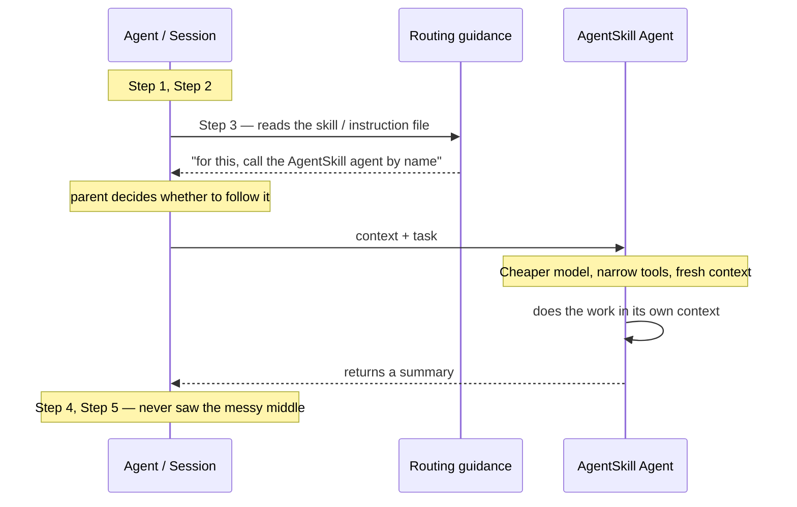

<div class="tldr-box">

**TL;DR** — Take a task you'd normally write as a skill, implement it as a *separate agent* with a cheaper model and a narrow tool set, and let your main session delegate to it as a sub-agent. I've been calling this the **AgentSkill pattern** because I couldn't find an official name for it. When the task suits it, this is one of the better levers I've got: you get **isolated context** almost every time, plus cheaper and often faster runs on top. Whether you get that second part comes down to two questions — is the task well-bounded and mostly *independent* of what the parent already has in context, and does a cheaper model actually do it well enough? Answer yes to both and it's a clear win. This post has the actual frontmatter for both Copilot and Claude Code, how to tell a good candidate from a bad one, and the gotchas that bit my team.

</div>

## A pattern with no name

My team and I keep reaching for the same shape of solution, and at some point I realized I had no idea what to call it. So I've been calling it the **AgentSkill pattern**, which is not a great name, but it's the one I've got. If you know what this is actually called, please tell me — that's a genuine ask, not a rhetorical one.

In the video I gave the two-minute version. This post is the part I promised on camera: the frontmatter, the details, and the stuff I've learned the hard way.

Quick refresher, because the vocabulary here matters. In my [earlier post on agents, skills, plugins, and extensions](/articles/agents-skills-plugins-extensions), I used an object-oriented analogy that I still think mostly holds up:

- **Agents** are like classes. A persona plus capabilities — who you are, what model you run on, what tools you're allowed to touch.
- **Skills** are like functions. A defined task or procedure. How something should get done.

It's not a perfect mapping — skills are portable across agents, which classes and functions don't really do — but it's close enough for scope and intent.

The AgentSkill pattern is what happens when you take something that looks like a function and implement it as a class anyway. On purpose.

## The shape of it

Here's the whiteboard from the video, cleaned up:



Your main session is chugging through a multi-step task. At step three, it recognizes there's a specialist for this — because you gave it something to recognize, whether that's a routing skill, an instruction file, or an agents doc. The parent then calls that agent *by name*, handing over some context plus the task. The sub-agent runs on a cheaper model with a deliberately small set of tools, does the work in its *own* context, writes up a summary, and hands the summary back. Your parent picks up at step four having never loaded any of the intermediate mess.

That last part is the whole point.

It's also worth being precise about who's doing what in that first step, because it's the thing that trips people up later: **the harness doesn't route. It makes options available.** Your guidance gets surfaced to the model along with everything else, and what comes back is a *choice* — not a guarantee. That distinction is invisible when it works and extremely visible when it doesn't, which is why there's a whole section on it below.

## Why it has to be an agent

Here's the thing that makes this a pattern rather than just "write a skill."

In most harnesses, **agent frontmatter is the only place you can pin the model and fence the tool set.** A skill tells the agent *how* to do something. An agent file tells the harness *what it's allowed to be* while doing it. If you want a cheaper model and fewer tools, you need the agent file.

And I want to reframe the `tools` field, because most guidance talks about it as a *safety* control — "don't let the docs agent run `rm -rf`." That's true and good. But in this pattern you're using it as a **context budget** control.

Every tool available to a session costs context before the agent does anything. The names, the descriptions, the parameter schemas — all of it gets serialized into the model's context window. If you've got a handful of MCP servers connected, that adds up fast. A sub-agent that only needs to read files and run one MCP tool doesn't need to be told about the other forty. Fencing the tools is how you keep the isolated context actually *small*, not just *separate*.

## Copilot: the two-file form

In the Copilot ecosystem this is two files: the agent that does the work, and a thin skill that nudges the parent toward calling it.

Take the example from the video — my team has a pipeline RCA agent. When a build fails, it goes and pulls logs, digs through run history, pokes at Azure resources, and comes back with a root cause. The parent session, which is usually trying to *fix* the pipeline, doesn't need any of that raw material. It needs the conclusion.

### The agent

```yaml
---
name: pipeline-rca
description: >
  Investigates failed CI/CD pipeline runs and returns a root cause analysis.
  Use when a build or release pipeline has failed and someone needs to know why
  before attempting a fix.
model: claude-haiku-4.5
tools:
  - read
  - search
  - execute
  - azure-devops/*
user-invocable: true
disable-model-invocation: false
---

You are a pipeline root cause analyst. You investigate failed runs and report
findings. You do not fix anything.

## What you get

A pipeline or run identifier, and whatever failure signal the caller already has.

## What you do

1. Pull the failed run and identify the first failing task — not the loudest error.
2. Fetch only the logs for that task. Do not fetch the full run log.
3. Check whether the same task has failed recently. Flag it if this is a pattern.
4. If the failure points at infrastructure, check the relevant resource health.

## What you return

A summary of no more than 15 lines:

- **Root cause** — one sentence.
- **Evidence** — the specific log lines or signals that support it.
- **Blast radius** — is this one run, this branch, or everything?
- **Confidence** — high, medium, or low, and say why if it isn't high.

Do not include raw log dumps. Do not propose a fix. The caller is doing that part.
```

Drop that in `.github/agents/pipeline-rca.agent.md` for the repo, or `~/.copilot/agents/` for your personal setup.

> That's an illustrative version, to be clear. The one my team actually runs is considerably more specific — which pipelines we care about, where our logs actually live, which Azure resources are worth checking, the failure patterns we've been bitten by before. I've stripped all of that out because it'd be meaningless to you. But don't mistake the skeleton for the thing: **the specificity is where the value is.** A generic "go investigate the build" agent isn't meaningfully cheaper or better than just asking the parent to do it. What makes a specialist worth the round trip is that it knows things the parent would otherwise have to go learn.

That "What you return" section at the bottom is doing more work than it looks like. **Be strict about the return contract**, because left to their own devices workers will happily hand back the entire artifact, narrate every tool call they made, or — my favorite — report success on something they didn't actually finish. Any of those undoes the isolation, the token savings, or your trust in the output, respectively.

A good return is boring: what ran, where the artifact landed, a status or a count, and maybe a hash if you care about integrity. The *thing itself* stays where the worker put it.

A few notes on those fields, all from the [custom agents configuration reference](https://docs.github.com/en/copilot/reference/custom-agents-configuration):

| Field | What it does for this pattern |
| --- | --- |
| `description` | **Required**, and it's load-bearing. This is what the parent model reads when deciding whether to delegate. Write it as "use this when…" not "this is a thing that…" |
| `model` | The whole reason you're doing this. If unset, the agent inherits the parent's model and you've saved nothing. |
| `tools` | Your context budget. Omit it or use `["*"]` and you get everything. Use `[]` to get nothing. |
| `user-invocable` | Set `false` if this should only ever be called programmatically by another agent, never picked from a menu. |
| `disable-model-invocation` | Set `true` and the harness will *never* auto-delegate — which is the opposite of what you want here, so leave it alone unless the agent is expensive or destructive. |
| `mcp-servers` | Lets the agent bring its own MCP servers. Not used by VS Code and other IDE agents. |
| `metadata` | Free-form annotation. Also ignored by IDE agents. |

The `tools` list takes aliases, and they're case-insensitive: `read`, `edit`, `search`, `execute` (a.k.a. `shell` / `bash` / `powershell`), `web`, `todo`, and `agent` (which lets *this* agent delegate to another one — careful with that in a sub-agent). You can namespace MCP tools with `server-name/tool-name`, or pull in a whole server with `server-name/*`. Unrecognized tool names are ignored rather than erroring, which is handy for writing one agent file that works across harnesses.

That last bit is also a trap, though. Tool names don't always match across agent frontmatter, whatever global tool filters your CLI applies, and the identifiers the runtime actually uses. And since a name it doesn't recognize gets silently dropped rather than shouted about, a typo in your allowlist looks identical to a tool that just isn't available. Run the thing end to end on the path you'll actually deploy, and confirm the worker really has what you think you gave it.

> Fair warning, same as last time: frontmatter support is uneven across harnesses and it moves. `argument-hint` and `handoffs` work in VS Code but are ignored by the cloud agent. If your agent won't load, strip it back to `name` and `description` and add fields one at a time until you find the one that broke it.

### The routing skill

This second file is the fix for a problem I'll get to below — the parent not reliably calling your agent. Its entire job is to put the suggestion in front of the model at the right moment.

```yaml
---
name: pipeline-rca
description: >
  Diagnose why a CI/CD pipeline run failed. Use before attempting any pipeline
  fix, whenever the root cause is not already established.
---

When a pipeline failure needs diagnosing, delegate to the `pipeline-rca` agent
rather than investigating inline.

Hand it:

- The pipeline or run identifier.
- Any failure signal you already have (the error the user pasted, the alert, etc).
- Whether this is a one-off or a recurring failure, if you know.

Wait for its summary before proposing a fix. Do not pull pipeline logs into this
session yourself — that's the whole reason the specialist exists.
```

That goes in `.github/skills/pipeline-rca/SKILL.md`. Note that this skill contains almost no domain knowledge — all of that lives in the agent. The skill is a signpost.

## Claude Code: the one-file form

I mentioned in the video that Claude Code users already have most of this built into skills, and that's true. It's worth spelling out because the frontmatter surface is genuinely nice.

Claude Code's skills follow the [Agent Skills](https://agentskills.io) open standard and then extend it with the fields that make this pattern work in a single file:

```yaml
---
name: pipeline-rca
description: >
  Diagnose why a CI/CD pipeline run failed and report a root cause.
  Use before attempting any pipeline fix.
when_to_use: >
  Trigger phrases: "why did the build fail", "the pipeline is red",
  "what broke the release".
argument-hint: "[run-id]"

context: fork          # run in an isolated subagent, not the main thread
agent: general-purpose # which subagent config supplies the execution environment
background: false      # wait for the result in this turn instead of backgrounding

model: haiku           # cheaper model, scoped to this skill
effort: low            # reasoning effort override

allowed-tools: Read Grep Bash(az pipelines *)
disallowed-tools: Write Edit
---

Investigate the failed pipeline run $ARGUMENTS.

1. Identify the first failing task — not the loudest error.
2. Fetch only that task's logs.
3. Check whether the same task has failed recently.

Return: root cause (one sentence), supporting evidence, blast radius, confidence.
No raw log dumps. No proposed fix.
```

Full field list is in the [skills documentation](https://code.claude.com/docs/en/skills). `context: fork` is the one that actually creates the isolation — the rest are modifiers.

### The part I didn't have room for on camera

Here's where I want to add some nuance to what I said in the video, because "Claude Code already does this" is *mostly* right but glosses over a real structural difference.

**With `context: fork`, your `SKILL.md` body becomes the child's prompt.** Not the parent's instructions — the child's. The subagent gets the skill content (after `$ARGUMENTS` substitution) as its task, and it has no access to your conversation history.

That's clean and elegant, and it's exactly what you want when the handoff compresses down to "here's an ID, go look at it."

But it means the parent never *composes* a brief. It just fills in a string. If your pattern needs the parent to distill a pile of loose requirements into an explicit, enumerated task spec before handing off — or to do any setup before and verification after — there's no slot for that. The skill body isn't addressed to the parent anymore.

Which is when the two-file split still earns its keep, and Claude Code supports that too: write a subagent in `.claude/agents/`, keep a normal inline skill that tells the parent how to prepare and route the handoff, and let the parent delegate. Skill body steers the parent, agent file defines the worker.

So the real framing isn't "Copilot is behind." It's: **the collapsed one-file form is a shortcut for the easy subset.** Use it when it fits, split it when it doesn't.

### Four things to know before you fork

These are all in the docs, but they're easy to skim past and each one has cost me time:

1. **`CLAUDE.md` still loads into the fork** unless the `agent` is `Explore` or `Plan`. If you assumed a clean context, you didn't get one — your repo instructions came along for the ride.
2. **Backgrounded forks run with a narrower tool set.** Since forks background by default now, a skill that depends on a tool outside that set will just quietly not work. Set `background: false` to keep the full set (and block the turn).
3. **Edits from a background fork land outside your checkpoints.** `/rewind` won't undo them. That's a git-only recovery, which is a fun thing to discover after the fact.
4. **`context: fork` needs an actual task.** If your skill is a pile of guidelines — "here are our API conventions" — forking it spawns a subagent with no instruction to act on. It'll return nothing useful and you'll have paid for the round trip.

## The benefits, honestly ranked

I put "in theory" on the whiteboard for a reason — but "in theory" doesn't mean "roll the dice." Each of these depends on something specific, and you can check for it up front:

| Benefit | You get it when… |
| --- | --- |
| **Isolated context** | Basically always. This one's structural — it comes with the handoff. |
| **Fewer credits** | The worker's context barely overlaps the parent's. Duplicated context is what eats the savings. |
| **Faster wall-clock** | The worker's job is one compact pass. A long stateful tool loop erases the gain. |

**Isolated context is the floor.** The other two are upside, and you earn them with task selection rather than luck — which is the whole point of the next section. What you shouldn't do is assume they showed up. Adopt the pattern for the cost savings, never check, and you can end up paying *more* for a worse result while feeling clever about it.

### Measure credits, not tokens

This one surprised me, so I'll save you the confusion: **a cheaper specialist can burn *more* total tokens and still cost you less.**

That sounds contradictory until you remember you're paying different rates for different models. Handing a task to a cheap worker that takes a rambling path to the answer can still come out ahead of an expensive model taking a direct one. Which means raw token totals will sometimes tell you a winning trade looks like a loss.

Look at three numbers separately:

- What the **parent** spent.
- What the **worker** spent.
- The **combined** total.

That last one is the only one that answers "was this worth it," and it's the one you're least likely to have on a dashboard.

One more thing that belongs in that total: **retries.** Routing failures, wrong-model invocations, partial outputs, runs you abandoned halfway — those all cost real money and they're part of the honest accounting. It's very easy to re-run a shaky setup until you get a good result and then report *that* one. Don't do that to yourself.

## When it actually pays off

The test I use now is the **overlap test**: *how much of the context the worker needs does the parent also need?*

If the answer is "almost none," you win. The parent hands over an identifier, the worker goes and reads a bunch of stuff the parent never has to see, and a short summary comes back. The pipeline RCA case is exactly this — the parent is trying to *fix* the pipeline and genuinely does not need six log files in its context to do that.

If the answer is "most of it," you lose. My favorite example of getting this wrong: "write the code, then delegate the tests to a cheaper agent." Sounds great. But the test-writing agent needs the same code, the same interfaces, and the same requirements the parent already has sitting in context. You pay for that twice, plus a round trip, plus a handoff summary — and then the parent loads the tests anyway to check them. You bought isolation you didn't need.

Which isn't a knock on delegating tests, to be clear. "Write one test file for this module, here are the three paths and the conventions" is a perfectly good AgentSkill. "Write tests for whatever we've been doing for the last hour" is not. The difference is entirely in how much the parent is already holding.

The general version: **if the task you're delegating effectively contains the whole problem, that's not decomposition — it's model substitution.** You've moved the same work to a different model and added a round trip. Sometimes that's genuinely what you want. Just be honest that it's what you're doing.

Good candidates look like:

- **Bounded** — you can describe the whole task in a paragraph.
- **Repeatable** — you'd do it the same way every time.
- **Independently evaluable** — you can tell whether the output is good without re-deriving it.
- **Conclusion-shaped** — the parent needs the answer, not the work.

Investigation, extraction, and summarization tasks fit well. "Continue what I was doing, but cheaper" does not.

### Shape the handoff, don't just throw it over the wall

The version that works for me is **one bounded read phase and one direct write.** The worker reads a known, small set of things; it writes the artifact itself; it returns a short status.

Which means the parent's job is to hand over a real envelope, not a vibe: explicit paths so the worker doesn't go browsing (browsing is how a cheap specialist turns into an expensive one), the conventions and constraints enumerated rather than implied, what this worker owns and must not touch, and where the artifact goes.

Having the worker write the artifact *directly* is the part people skip, and it matters: if the artifact comes back through the parent as text, it lands in the parent's context and you've undone the thing you were optimizing for.

### Restrict the parent after the handoff, too

This one's easy to miss. You do all the work to isolate the specialist… and then the parent re-reads the artifact to "check it," re-runs it, tidies it up, or writes its own summary of the summary.

Congratulations, the context is back. You paid for a round trip and a second model to get an isolation benefit you then immediately gave away.

To be fair, there are absolutely times you *want* the parent validating the child's work — the stakes are high, the output feeds directly into the next step, you don't trust the specialist yet. That's a legitimate call. Just be clear-eyed that in this pattern it eats most of what you came for: the parent has to load the artifact to judge it, which is the context you were isolating, and it judges on the expensive model, which is the spend you were avoiding. You've kept the round trip and given back the savings.

If you need validation, prefer somewhere outside the parent for it — which is the next section. And if you find the parent *always* needs to check the work, that's a strong signal this task wanted to stay inline.

## The risk that isn't on the whiteboard

Here's the one I'd most want someone to have told me: **a cheaper model working in an isolated context can quietly produce worse output.**

Not obviously worse. Not error-worse. Just… a bit thinner. A summary that drops the detail that mattered. An investigation that stops one level short of the actual root cause. Output that reads fine right up until someone downstream acts on it.

And the failure mode is nasty, because the metrics you're most likely to be watching — tokens, credits, elapsed time — will all look *great*. That's the trade you made. The thing that got worse isn't on any dashboard.

So if you adopt this pattern, measure the artifact. Run the same task both ways, isolated and inline, and compare the *outputs* — not the spend. And do it in fresh sessions, because leftover context from building the thing will paper over gaps in your instructions and make the specialist look smarter than it is.

**Validate outside the parent.** This is the part that makes the measurement actually work. The temptation is to have the parent read the artifact and tell you whether it's good — but now you're paying your expensive model to grade your cheap one, in the context you were trying to keep clean, using a judge that has every incentive to be agreeable. Push validation somewhere deterministic instead: CI, the existing test suite, schema validation, a linter, a script that checks the thing has the shape it's supposed to have. Zero AI involved. If production genuinely needs a model in that loop, fine — but make that a decision, not a default.

**And pick the cheapest model that clears the bar, not the cheapest model.** Those aren't the same thing and I conflated them for a while. If the smallest option produces output that doesn't hold up, moving up a tier is the right call — but be aware that a strong enough specialist can erase the cost advantage entirely, at which point you're doing all this work for the context isolation alone. Which is a perfectly good reason! It's just a different reason than the one you started with, and worth noticing when it happens.

Sometimes the honest answer is that the pattern doesn't pay for itself on this particular task. That's a fine outcome. It's just one you have to actually go looking for.

## The routing gotcha

Last one, and it's the one I got wrong for a while: I used to think the problem was that the harness *couldn't find* my sub-agent.

It's not. Discovery works fine — write a decent description and the harness will surface the skill and load it. What fails is **routing**.

Here's the thing that took me too long to internalize: **a skill is advisory prose, not a binding.** Nothing mechanically connects a skill to an agent. Your routing skill says "delegate this to `pipeline-rca`," that text goes into the prompt alongside everything else, and what comes back is a decision that might not be the one you wanted. It might:

- Fire a *generic* task delegation instead of calling your named agent.
- Pick a different default worker.
- Load your skill again. And again.
- Shrug and do the work itself inline.

And here's the consequence that matters, because it undermines the entire premise of the pattern:

> **The `model:` in your agent file only takes effect once that exact agent is selected.**

If the parent fires a generic delegation instead of naming your specialist, your cheap model never governs anything. The work happens on the parent's expensive model, in a sub-context you thought was configured. You get the isolation. You don't get the savings. And nothing in the output tells you — the summary comes back looking exactly like it was supposed to.

So treat routing adherence as part of *correctness*, not implementation trivia. When you're validating this pattern, check three things independently:

1. Which agent did the parent **request**?
2. Which agent actually **ran**?
3. Which model did it actually run **on**?

Those three can disagree, and every combination of disagreement costs you something different.

### What actually helps

1. **Add a wrapper skill.** Still my default. It gives the parent a concise entry point and stops me duplicating the same instructions into every prompt. But be honest about what it buys you: better odds, not a guarantee. It can't stop generic delegation or a fallback to a different worker.
2. **Point at it from an instruction file.** An `AGENTS.md` or `copilot-instructions.md` that says "when you need X, delegate to the `Y` agent — by name" is a stronger signal than the agent's own description.
3. **Keep a routing file.** If you've got several specialists, one file listing them and when each applies works well. Same idea, centralized.

Stacking all three took this from flaky to mostly-reliable for us. *Mostly.*

What would actually fix it is a first-class operation that binds a skill to exactly one agent, one model, and one tool allowlist — enforced by the harness, rather than described in prose and hoped for. Until then, this is prose-directed selection, and prose-directed selection is probabilistic. Build your expectations accordingly.

## The side benefit: it's already automation-shaped

Here's something I didn't plan for and now actively design toward. **Once you have a good AgentSkill, you've also got a unit of automation.**

Look back at what makes a task a good candidate for this pattern: bounded, narrow well-defined inputs, doesn't need conversation history, produces a checkable artifact, returns a compact result. That's the same list you'd write if someone asked what makes a task safe to run *unattended*. Which means a specialist that behaves as a sub-agent will usually behave just fine when the thing calling it isn't a parent session at all — it's a trigger.

Take the pipeline RCA agent. Right now it waits for someone to notice a red build and go ask about it. But nothing about it requires a human in the loop. We can wire up a workflow so that when a pipeline fails, it files a bug and then runs `pipeline-rca` against the failed run, dropping the analysis straight onto the ticket. By the time anyone opens it, the root cause is already sitting there waiting.

Same agent file. No changes. The only difference is who called it.

That's also a decent argument for building the specialist in cases where the inline-versus-delegated math comes out close to even. If the delegated version costs about the same as doing it in the parent, but it can *also* run at 3am without you, that's not really even.

## Tools and docs

| Resource | What it's good for |
| --- | --- |
| [Copilot custom agents configuration](https://docs.github.com/en/copilot/reference/custom-agents-configuration) | The full frontmatter reference and tool alias table |
| [Custom agents in VS Code](https://code.visualstudio.com/docs/agent-customization/custom-agents) | The IDE side, including `handoffs` |
| [Agent Skills](https://agentskills.io) | The open standard skills are built on |
| [Claude Code skills](https://code.claude.com/docs/en/skills) | `context: fork`, `model`, `effort`, tool fencing |
| [Claude Code subagents](https://code.claude.com/docs/en/sub-agents) | The two-file form, and what actually loads into a subagent |

## Try one thing

Pick one bounded task you already do repeatedly — a log investigation, an extraction, a "go read this and tell me what it says" job. Write the agent file with a cheaper model and a deliberately stingy tool list. Add the wrapper skill so it actually gets invoked.

Then run it and check four things:

1. **Did your agent actually run?** Not a generic delegation — yours, by name, on the model you specified.
2. **What did it cost, combined?** Parent plus worker, in credits. Not tokens.
3. **Is the output as good?** Compare against doing it inline, in a fresh session.
4. **Did the parent stay out of it?** Or did it re-read the artifact and undo your isolation?

If all four hold up, you've got a keeper. If they don't, you've learned something more useful than a savings number.

And seriously — if this pattern already has a real name, come tell me. I'd much rather use the right word than keep making one up.

## One more thing

The reason I keep coming back to this pattern isn't the savings. It's that it forces me to be honest about what a task actually needs.

You can't write a good AgentSkill without answering "what does the parent genuinely need back from this?" — and that question is worth asking even when the answer turns out to be "everything, don't delegate this." Half the value here is in the design work, not the delegation.

Which, honestly, is most of this job now.
